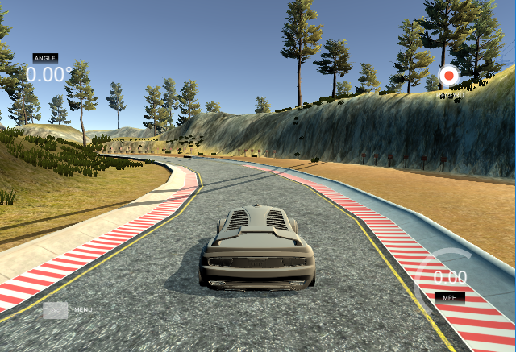

# Behavioral Cloning Project

Overview
---

This repository is to submit the project outcome of [Udacity - Self-Driving Car NanoDegree - Behavioral Cloning](https://github.com/udacity/CarND-Behavioral-Cloning-P3)

The goals / steps of this project are the following:
* Use the simulator to collect data of good driving behavior 
* Design, train and validate a model that predicts a steering angle from image data
* Use the model to drive the vehicle autonomously around the first track in the simulator. The vehicle should remain on the road for an entire loop around the track.

Contents
---

1. [README](README.md)
1. Code
   1. [model.py](model.py) : script used to create and train the model
   1. [drive.py](drive.py) : script to drive the car
   1. [modle.h5](model.h5) : a trained Keras model
1. [Writeup Report](writeup_report.md)
1. [Output Video](video.mp4)

LICENSE
---

MIT License
